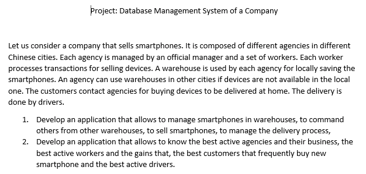
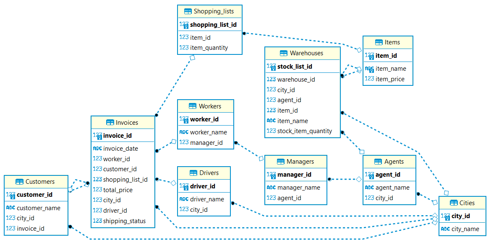
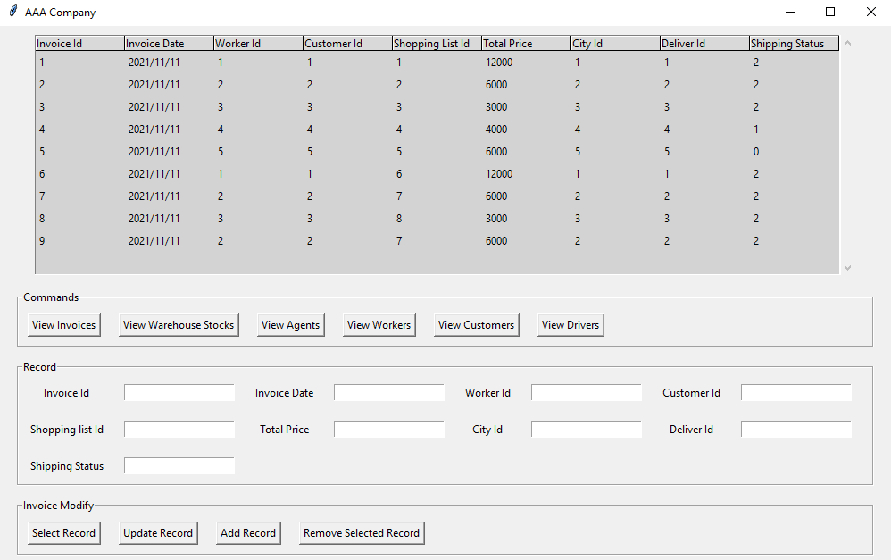

# Management Information Systems Group Project

Group Project Report \
Date: 06-12-2021

## Project Requirements:




## Our Group Member and Contribution 
1. **GOH ****, 2018059078**
   - Manage project roadmap
   - Database Design and Quary
   - User Interface and functions
   - Project document
2. **LAI ****, 2018054619**
   - Database Design and Quary
   - User Interface and functions
   - Project document
3. **YE ****, 2018054615**
   - Database Design and Quary
   - User Interface and functions
   - Project document and PowerPoint


## How to run this project on your pc
1. Download project file from [Here](https://github.com/gohlihan/SQLproject)
2. Open the project folder.
3. Run ```Main.py``` in your python terminal.

\
\
### File Descriptions
#### Main File
1. ```Main.py``` All the functions are here, Run this file in ternminal.
2. ```CreatingDatabase.py``` Create database with preset tables.
3. ```AddingData.py``` Input the preset data to the database.
4. ```system.db``` The database file created from ```CreatingDatabase.py```, delete before you create a new database.

#### Not Crucial File
5. ```DbFunction.py``` We use to test our Python+SQLite functions


## Project Plan  

**Languages we use:** Python, SQLite

**Tools we use:** 
  1. SQLite3 from python (database)
  2. Tkinter from python (GUI)
  3. DBeaver (to test our quary)
  4. Visual Studio Code, PyCharm
  5. Github (for version control and collaboration)

We use Python and SQLite to create the database and functions,
then we use Tkinter to create the User Interface so that we can interact with the databse by clicking the buttons in GUI.

We use SQLite because it is serverless, convenient to use without install or setup anything, and also easy to build quary than others.

We also use Github for idea exchange and code collaboration, and most importantly, we use it for version control during development.

## Roadmap 
- [x] Setup Github repository (18-11-2021)
- [x] Creating Tables and Database (24-11-2021)
- [x] Fill in the Data (26-11-2021)
- [x] Complete the query to fulfill the requirents (04-12-2021)
- [x] Make a GUI and bind all functions into it (06-12-2021)
- [x] Test, Debug, Refine (06-12-2021)
- [x] Docs and PPT (06-12-2021)
- [x] **Finished** (06-12-2021)

\
\
\
**Requirement 1**
  - [x] Warehouse can manage their stocks
  - [x] Command between warehouses(changing invoices location)
  - [x] Able to create new invoices (making sales)
  - [x] Able to manage delivery process (changing the delivery status)


**Requirement 2**
  - [x] Show the Best active agents and their sales result
  - [x] Show the Best active workers and their sales result
  - [x] Who is the Top new phone buyer
  - [x] Who is the Top active driver

## Result
Database ER Diagram
  

The GUI
  

## Tutorial we reference
[https://www.sqlitetutorial.net/](https://www.sqlitetutorial.net/)

[https://www.sqlitetutorial.net/sqlite-python/](https://www.sqlitetutorial.net/sqlite-python/)

[https://www.pythontutorial.net/tkinter/](https://www.pythontutorial.net/tkinter/)

[Python GUI's With TKinter(#172-#178)](https://www.youtube.com/watch?v=G9seoA3Mv4Y&list=PLCC34OHNcOtoC6GglhF3ncJ5rLwQrLGnV&index=172)


